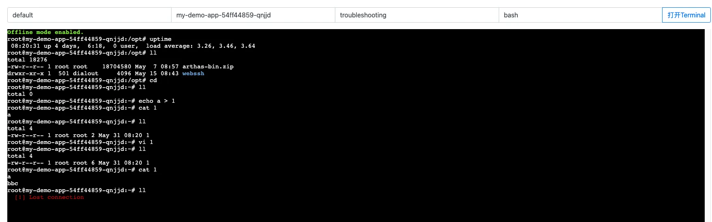

# fork source 

https://github.com/va1da5/xtermjs-for-k8s-pods

# xterm.js for K8s Pod Web Terminal

This is a proof-of-concept (PoC) attempt to communicate directly with Kubernetes/OpenShift Websocket, proxy the requests and expose it using `xterm.js` terminal emulator.




## Requirements

- NodeJS
- K8s environment (Minishift/Minikube/Kind)

## Server

```bash
# Install required dependencies
npm install

# Start PoC server
npm run serve

```
# Browser opens
[http://localhost:3000](http://localhost:3000)

## References

- [xterm.js](https://xtermjs.org/)
- [kubernetes-client/javascript](https://github.com/kubernetes-client/javascript)
- [Kubernetes Container Terminal](https://github.com/kubernetes-ui/container-terminal)
- [Developing Start Kubernetes with React, TypeScript, and Skaffold](https://dev.to/peterj/developing-start-kubernetes-with-react-typescript-and-skaffold-4em7)
- [Executing commands in Pods using K8s API](https://www.openshift.com/blog/executing-commands-in-pods-using-k8s-api)
- [Use a WebSocket client to exec commands in a Kubernetes pod](https://jasonstitt.com/websocket-kubernetes-exec)
- [Token-based Header Authentication for WebSockets behind Node.js](https://yeti.co/blog/token-based-header-authentication-for-websockets-behind-nodejs/)
- [ws: a Node.js WebSocket library](https://github.com/websockets/ws)
- [How does 'kubectl exec' work?](https://erkanerol.github.io/post/how-kubectl-exec-works/)
- [Attacking and Defending Kubernetes: Bust-A-Kube – Episode 1](https://www.inguardians.com/attacking-and-defending-kubernetes-bust-a-kube-episode-1/)
- [Configure Service Accounts for Pods](https://kubernetes.io/docs/tasks/configure-pod-container/configure-service-account/)
- [Writing WebSocket servers](https://developer.mozilla.org/en-US/docs/Web/API/WebSockets_API/Writing_WebSocket_servers)
- [How It Works — kubectl exec](https://itnext.io/how-it-works-kubectl-exec-e31325daa910)
